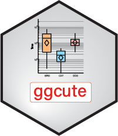

# ggcute <a href="">[](https://safer-r.github.io/ggcute)</a>

<br />

<!-- badges: start -->

[](https://app.codecov.io/github/safer-r/ggcute?branch=master)
[](https://cran.r-project.org/package=ggcute)
[](https://www.rdocumentation.org/trends)
[](https://opensource.org/licenses/MITgpl-3-0)
[](https://github.com/safer-r/ggcute/actions/workflows/rworkflows.yml)
<!-- badges: end -->

<br />

## Table of content

   - [Description](#description)
   - [Content](#content)
   - [Versions](#versions)
   - [Installation](#installation)
   - [Licence](#licence)
   - [Citations](#citations)
   - [Credits](#credits)
   - [Acknowledgements](#acknowledgements)

<br />


## Description

Set of R functions for the development of R functions, written according to the [safer project](https://github.com/safer-r) specifications.

<br />

## Content
<br />

| Function | Description |
| :--- | :--- |
| **gg_palette()** | select colors on the ggplot2 default color palette. |
| **gg_just()** | ggplot2 justification of annotated text or axis labeling, depending on angle. |
| **gg_get_legend()** | get the legend of ggplot objects. |
| **gg_point_rast()** | ggplot2 raster scatterplot layer. |
| **gg_boxplot()** | ggplot2 boxplot + dots + means + median/mean values. |
| **gg_scatter()** | ggplot2 scatterplot + lines (up to 6 overlays totally). |
| **gg_donut()** | ggplot2 donut. |
| **gg_empty_graph()** | generate an empty graphic device with text in the middle. |

<br />

Read `vignette("ggcute")` for more details.

<br />

## Versions

The different *ggcute* releases are tagged [here](https://github.com/safer-r/ggcute/tags).

<br />

## Installation

*ggcute* can be currently be installed from GitHub:

```r
install.packages("remotes")
remotes::install_github("https://github.com/safer-r/ggcute") # or open R as admin and remotes::install_github("https://github.com/safer-r/ggcute", lib = "C:/Program Files/R/R-4.3.1/library")
```

Older versions can be installed like this:

```r
v <- "v1.0" # desired tag version
remotes::install_github(paste0("https://github.com/safer-r/ggcute/tree/", v))
```

<br />

## Licence

This package can be redistributed and/or modified under the terms of the GNU General Public License as published by the Free Software Foundation, either version 3 of the License, or (at your option) any later version.
Distributed in the hope that it will be useful, but without any warranty; without even the implied warranty of merchandability or fitness for a particular purpose.
See the GNU General Public License for more details at https://www.gnu.org/licenses or in the Licence.txt attached file.

<br />

## Citation

If you are using functions of *ggcute*, please cite: 

> Wang H, Han Y, Serizay J, Millot GA (2023). _The R ggcute package_.
> <https://github.com/safer-r/ggcute/>.

<br />

## Credits

[Haiding Wang](https://github.com/Tintin2710), Bioinformatics and Biostatistics Hub, Institut Pasteur, Paris, France

[Yushi Han](https://github.com/yushiHn), Bioinformatics and Biostatistics Hub, Institut Pasteur, Paris, France

[Jacques Serizai](https://github.com/js2264), Spatial Regulation of Genomes team, Institut Pasteur, Paris, France

[Gael A. Millot](https://github.com/gael-millot), Bioinformatics and Biostatistics Hub, Institut Pasteur, Paris, France

<br />

## Acknowledgements

The developers & maintainers of the mentioned softwares and packages, including:

- [R](https://www.r-project.org/)
- [Git](https://git-scm.com/)
- [Github](https://github.com/)


